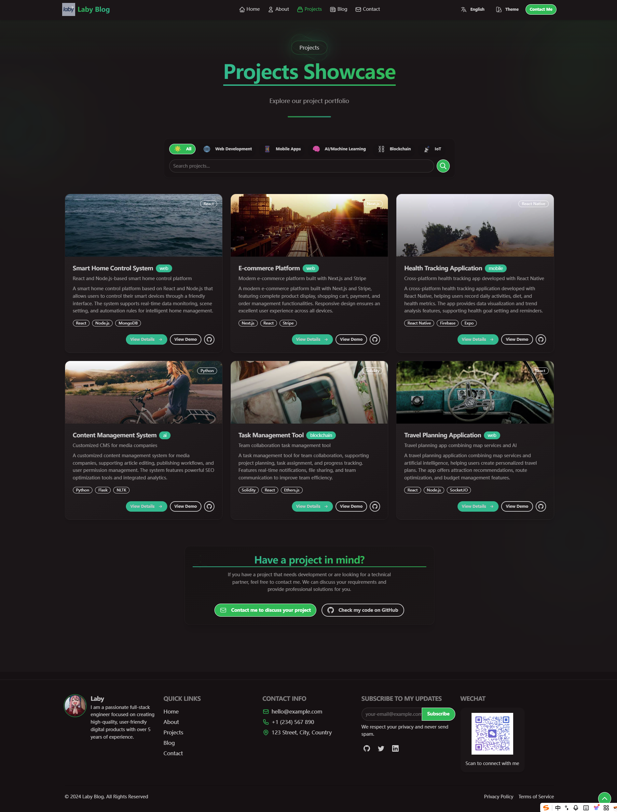
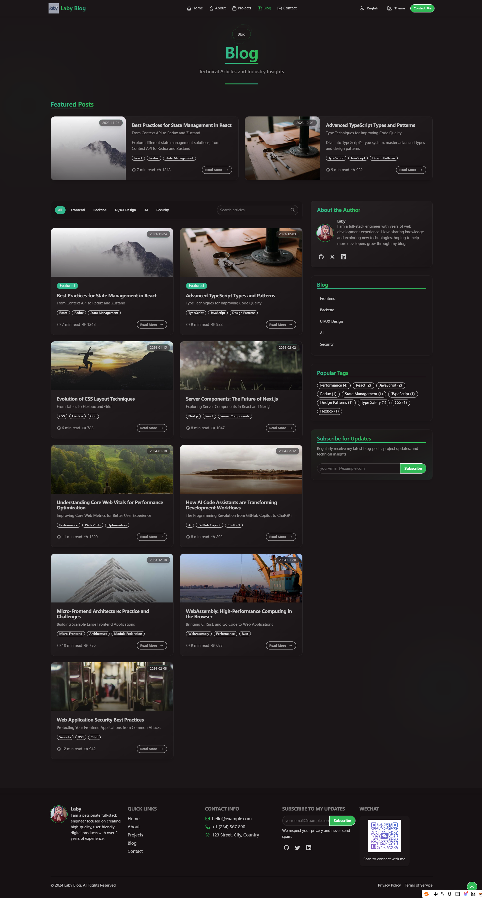
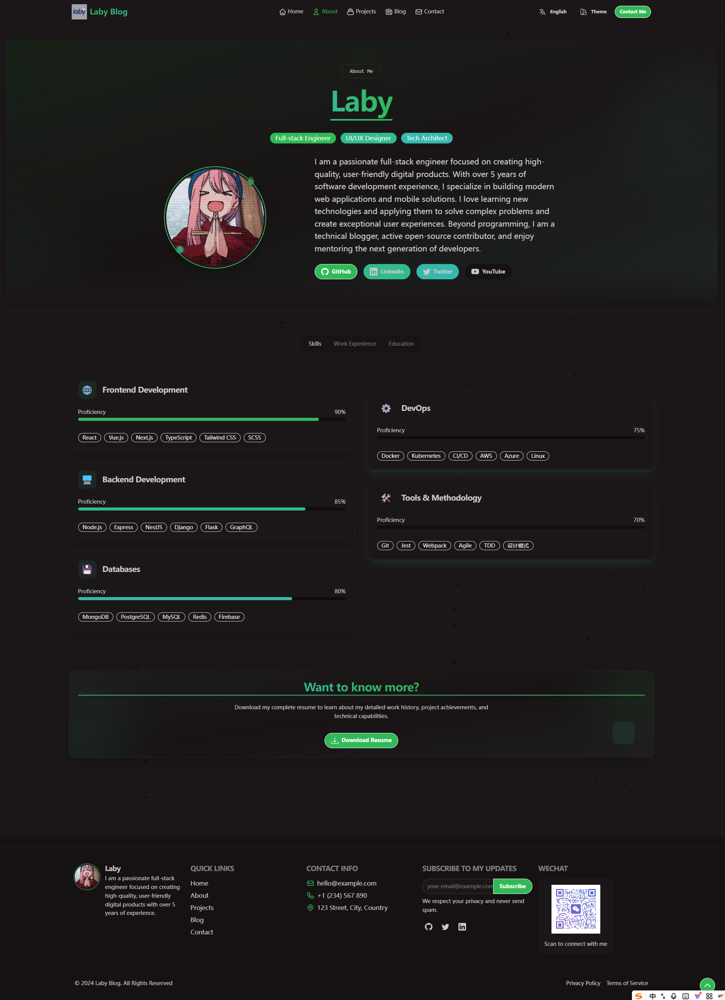

<div align="center">
  <h1>DaisyUI Blog</h1>
  <p>🌸 A modern, responsive personal blog and portfolio system</p>
  <p>
    
    
    
    
    
  </p>
  <p>
    <a href="https://github.com/MasterLiu93/daisyui-blog/stargazers">
      
    </a>
    <a href="https://github.com/MasterLiu93/daisyui-blog/network/members">
      
    </a>
    <a href="https://github.com/MasterLiu93/daisyui-blog/issues">
      
    </a>
  </p>
  <p>
    <a href="README.md">中文</a> | 
    <a href="README-EN.md">English</a>
  </p>
</div>

## ✨ Introduction

DaisyUI Blog is a modern personal blog and portfolio showcase system built with React, TypeScript, and Tailwind CSS. It provides rich animations, multilingual support, theme switching, and responsive design, making it perfect for developers to showcase personal projects and write technical blogs.

<div align="center">
  
</div>

## 🚀 Features

- **Multiple Themes** - 28 beautiful preset themes, including light/dark modes
- **Internationalization** - Complete multilingual support (English/Chinese) with modular translation files
- **Responsive Design** - Perfect adaptation for mobile devices, tablets, and desktops
- **Advanced Animations** - Rich interactive animations and transitions based on Framer Motion
- **Modular Design** - Strict component encapsulation and code organization
- **Built-in Components** - Includes blog system, project showcase, skills display, 3D tech stack, and more
- **Performance Optimization** - Using React best practices for a smooth experience

## 🔥 Previews

<table>
  <tr>
    <td width="33%">
      
      <p align="center">Projects Showcase</p>
    </td>
    <td width="33%">
      
      <p align="center">Blog System</p>
    </td>
    <td width="33%">
      
      <p align="center">About Page</p>
    </td>
  </tr>
</table>

## 🛠️ Tech Stack

- **Frontend Framework:** React 18
- **Type System:** TypeScript
- **Build Tool:** Vite
- **Styling:** Tailwind CSS + DaisyUI
- **Animation:** Framer Motion
- **Routing:** React Router v6
- **Internationalization:** React-i18next
- **State Management:** React Hooks

See [Detailed Tech Stack](#detailed-tech-stack) for more information.

## 📦 Quick Start

### Online Demo

- [Example Site](#) _(Coming soon)_

### Local Development

```bash
# Clone the repository
git clone https://github.com/MasterLiu93/daisyui-blog.git

# Enter the project directory
cd daisyui-blog

# Install dependencies
npm install

# Start the development server
npm run dev

# Build for production
npm run build
```

## 🧩 Project Structure

```
daisyui-blog/
├── public/               # Static assets
│   └── images/           # Image resources
├── src/
│   ├── components/       # Reusable components
│   ├── pages/            # Page components
│   ├── i18n/             # Internationalization files
│   │   └── locales/      # Translation files
│   ├── assets/           # Other assets
│   ├── App.tsx           # Root application component
│   └── main.tsx          # Entry file
└── README.md
```

## ⚙️ Configuration

### Theme Configuration

The project supports 28 beautiful themes, managed by DaisyUI:

```js
// tailwind.config.js
module.exports = {
  // ...other configurations
  daisyui: {
    themes: [
      "light", "dark", "cupcake", "bumblebee", "emerald",
      // ... more themes
    ],
  },
}
```

### Adding New Languages

1. Copy existing translation files
2. Translate content
3. Register the new language in `src/i18n/index.ts`

```js
// src/i18n/index.ts
i18n.init({
  resources: {
    en: { translation: { /* English translations */ } },
    zh: { translation: { /* Chinese translations */ } },
    // Add new language
    fr: { translation: { /* French translations */ } }
  },
  // ... other configurations
});
```

## <a name="detailed-tech-stack"></a>🔧 Detailed Tech Stack

### Core Technologies
- **React 18.2.0**: JavaScript library for building user interfaces
- **TypeScript 5.2.2**: JavaScript superset with static type checking
- **Vite 7.1.4**: Modern frontend build tool providing lightning-fast dev server and optimized builds
- **Node.js 20+**: Runtime environment

### Styling & UI
- **Tailwind CSS 3.4.1**: Utility-first CSS framework
- **DaisyUI 5.1.7**: Tailwind-based component library with 28 customizable themes
- **PostCSS 8.4.36**: CSS transformation tool
- **Autoprefixer 10.4.17**: Automatic CSS prefix addition

### More Technical Details
- **State Management**: React Hooks (useState, useEffect, useRef, useMemo, useCallback)
- **Animation**: Framer Motion 11.0.8 (page transitions, scroll triggers, gesture responses, advanced path animations)
- **Internationalization**: react-i18next 14.1.0 + i18next 23.10.1
- **Special Features**: Canvas API (particle backgrounds), Intersection Observer API (scroll animations)

## 📋 Features

- ✅ Home - Dynamic hero section, skills showcase, portfolio preview, blog preview
- ✅ About - Personal introduction, detailed skills, work history
- ✅ Projects - Filterable project showcase, project detail modals
- ✅ Blog - Article listings, category filtering, tag cloud, search functionality
- ✅ Contact - Contact form, FAQ, location information
- ✅ Multilingual - Complete English and Chinese support, easily extendable
- ✅ Theme System - 28 preset themes, switch with one click

## 🤝 Contribution Guide

Contributions to code, issues, or feature requests are welcome!

1. Fork the repository
2. Create your feature branch: `git checkout -b my-new-feature`
3. Commit your changes: `git commit -m 'Add some feature'`
4. Push to the branch: `git push origin my-new-feature`
5. Submit a Pull Request

## 📜 License

[MIT License](LICENSE) © MasterLiu93

## 💖 Acknowledgments

- [React](https://reactjs.org/)
- [TypeScript](https://www.typescriptlang.org/)
- [Tailwind CSS](https://tailwindcss.com/)
- [DaisyUI](https://daisyui.com/)
- [Framer Motion](https://www.framer.com/motion/)
- [React Router](https://reactrouter.com/)
- [React-i18next](https://react.i18next.com/)

---

<div align="center">
  <p>⭐ If this project helped you, please give it a star! ⭐</p>
  <p>
    <a href="https://github.com/MasterLiu93">
      
    </a>
  </p>
</div> 