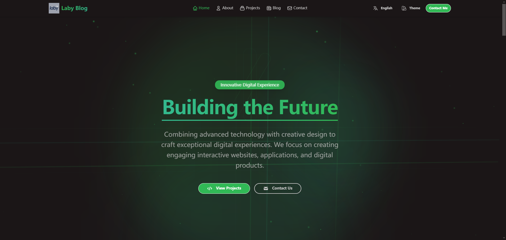
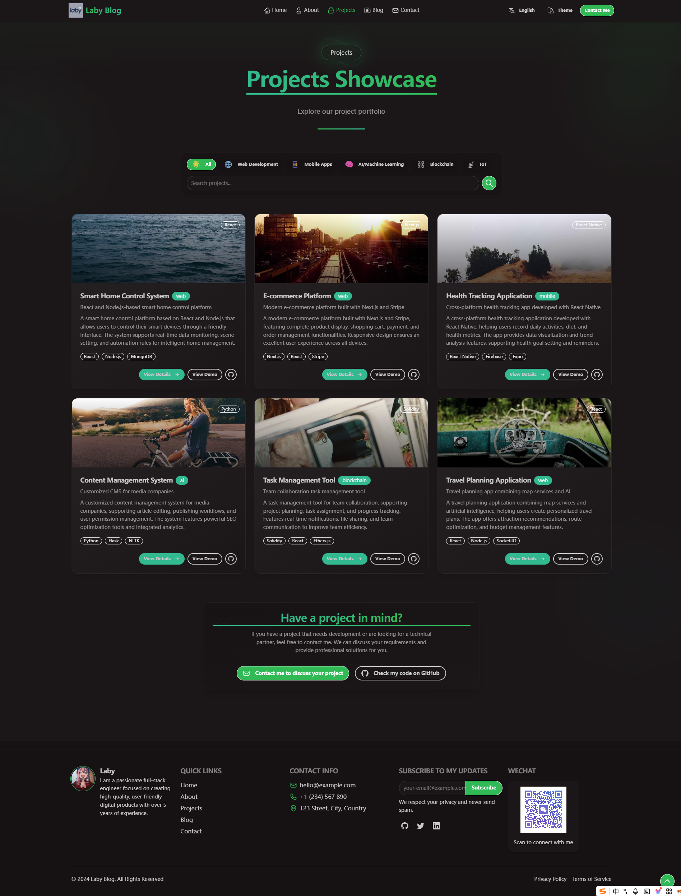
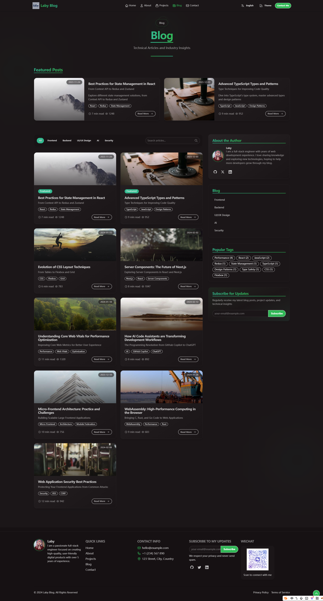
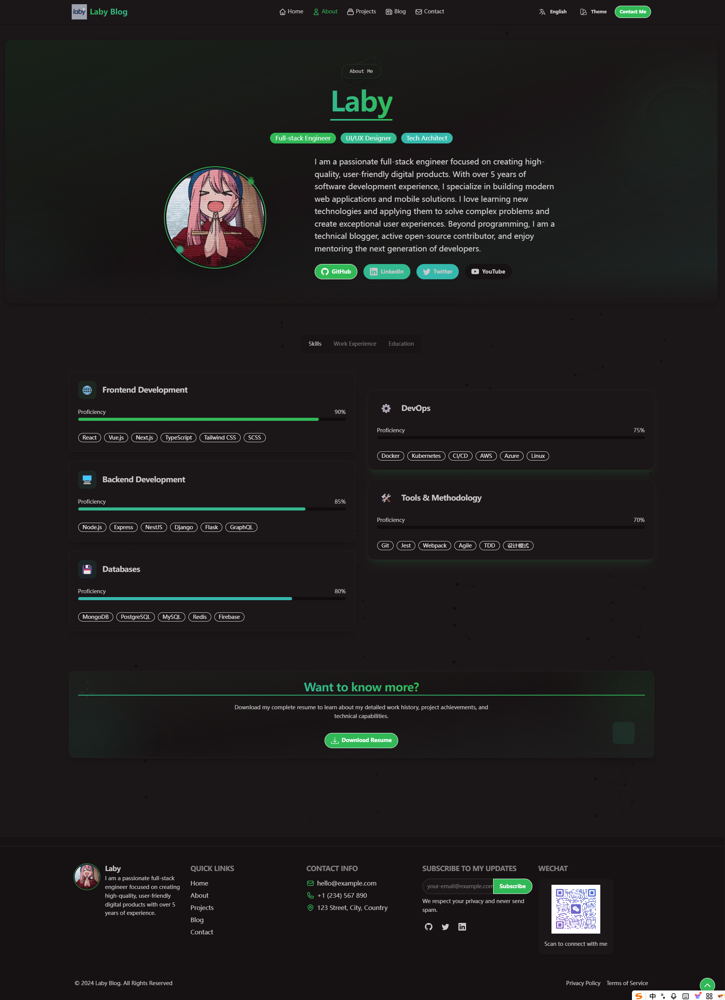

<div align="center">
  <h1>DaisyUI Blog</h1>
  <p>🌸 现代化、响应式的个人博客和作品集系统</p>
  <p>
    
    
    
    
    
  </p>
  <p>
    <a href="https://github.com/MasterLiu93/daisyui-blog/stargazers">
      
    </a>
    <a href="https://github.com/MasterLiu93/daisyui-blog/network/members">
      
    </a>
    <a href="https://github.com/MasterLiu93/daisyui-blog/issues">
      
    </a>
  </p>
  <p>
    <a href="README-EN.md">English</a> | 
    <a href="README.md">中文</a>
  </p>
</div>

## ✨ 简介

DaisyUI Blog是一个基于React、TypeScript和Tailwind CSS构建的现代化个人博客和作品集展示系统。它提供了丰富的动画效果、多语言支持、主题切换和响应式设计，适合开发者用来展示个人项目和撰写技术博客。

<div align="center">
  
</div>

## 🚀 特性

- **多主题支持** - 28种精美预设主题，包括浅色/深色模式
- **国际化** - 完整的多语言支持（中/英），基于模块化的翻译文件系统
- **响应式设计** - 完美适配移动设备、平板和桌面端
- **先进动画** - 基于Framer Motion的丰富交互动画和过渡效果
- **模块化设计** - 严格的组件封装和代码组织
- **内置组件** - 包含博客系统、项目展示、技能展示、3D技术栈等特色组件
- **性能优化** - 使用React最佳实践确保流畅体验

## 🔥 预览

<table>
  <tr>
    <td width="33%">
      
      <p align="center">项目展示</p>
    </td>
    <td width="33%">
      
      <p align="center">博客系统</p>
    </td>
    <td width="33%">
      
      <p align="center">关于页面</p>
    </td>
  </tr>
</table>

## 🛠️ 技术栈

- **前端框架:** React 18
- **类型系统:** TypeScript
- **构建工具:** Vite
- **样式方案:** Tailwind CSS + DaisyUI
- **动画系统:** Framer Motion
- **路由:** React Router v6
- **国际化:** React-i18next
- **状态管理:** React Hooks

查看[详细技术栈](#detailed-tech-stack)了解更多。

## 📦 快速开始

### 在线演示

- [示例网站](#) _(即将推出)_

### 本地开发

```bash
# 克隆仓库
git clone https://github.com/MasterLiu93/daisyui-blog.git

# 进入项目目录
cd daisyui-blog

# 安装依赖
npm install

# 启动开发服务器
npm run dev

# 构建生产版本
npm run build
```

## 🧩 项目结构

```
daisyui-blog/
├── public/               # 静态资源
│   └── images/           # 图片资源
├── src/
│   ├── components/       # 可复用组件
│   ├── pages/            # 页面组件
│   ├── i18n/             # 国际化文件
│   │   └── locales/      # 翻译文件
│   ├── assets/           # 其他资源
│   ├── App.tsx           # 应用根组件
│   └── main.tsx          # 入口文件
└── README.md
```

## ⚙️ 配置

### 主题配置

项目支持28种精美主题，使用DaisyUI进行主题管理：

```js
// tailwind.config.js
module.exports = {
  // ...其他配置
  daisyui: {
    themes: [
      "light", "dark", "cupcake", "bumblebee", "emerald",
      // ... 更多主题
    ],
  },
}
```

### 添加新语言

1. 复制现有翻译文件
2. 翻译内容
3. 在`src/i18n/index.ts`中注册新语言

```js
// src/i18n/index.ts
i18n.init({
  resources: {
    en: { translation: { /* 英文翻译 */ } },
    zh: { translation: { /* 中文翻译 */ } },
    // 添加新语言
    fr: { translation: { /* 法语翻译 */ } }
  },
  // ... 其他配置
});
```

## <a name="detailed-tech-stack"></a>🔧 详细技术栈

### 核心技术
- **React 18.2.0**: 用于构建用户界面的JavaScript库
- **TypeScript 5.2.2**: 添加静态类型检查的JavaScript超集
- **Vite 7.1.4**: 现代前端构建工具，提供极速的开发服务器和优化的构建
- **Node.js 20+**: 运行环境

### 样式与UI
- **Tailwind CSS 3.4.1**: 实用程序优先的CSS框架
- **DaisyUI 5.1.7**: 基于Tailwind的组件库，提供28种可定制主题
- **PostCSS 8.4.36**: CSS转换工具
- **Autoprefixer 10.4.17**: 自动添加CSS前缀

### 更多技术细节
- **状态管理**: React Hooks (useState, useEffect, useRef, useMemo, useCallback)
- **动画**: Framer Motion 11.0.8 (页面过渡、滚动触发、手势响应、高级路径动画)
- **国际化**: react-i18next 14.1.0 + i18next 23.10.1
- **特殊功能**: Canvas API (粒子背景)、Intersection Observer API (滚动动画)

## 📋 功能

- ✅ 首页 - 动态英雄区、技能展示、作品集预览、博客预览
- ✅ 关于页 - 个人介绍、技能详情、工作经历
- ✅ 项目页 - 可筛选的项目展示、项目详情模态框
- ✅ 博客页 - 文章列表、分类过滤、标签云、搜索功能
- ✅ 联系页 - 联系表单、FAQ、位置信息
- ✅ 多语言 - 中英文完整支持，易于扩展
- ✅ 主题系统 - 28种预设主题，一键切换

## 🤝 贡献指南

欢迎贡献代码、提交问题或功能请求！

1. Fork 仓库
2. 创建功能分支: `git checkout -b my-new-feature`
3. 提交更改: `git commit -m 'Add some feature'`
4. 推送到分支: `git push origin my-new-feature`
5. 提交 Pull Request

## 📜 许可证

[MIT License](LICENSE) © MasterLiu93

## 💖 鸣谢

- [React](https://reactjs.org/)
- [TypeScript](https://www.typescriptlang.org/)
- [Tailwind CSS](https://tailwindcss.com/)
- [DaisyUI](https://daisyui.com/)
- [Framer Motion](https://www.framer.com/motion/)
- [React Router](https://reactrouter.com/)
- [React-i18next](https://react.i18next.com/)

---

<div align="center">
  <p>⭐ 如果这个项目对你有帮助，请给它一个星标！ ⭐</p>
  <p>
    <a href="https://github.com/MasterLiu93">
      
    </a>
  </p>
</div>
